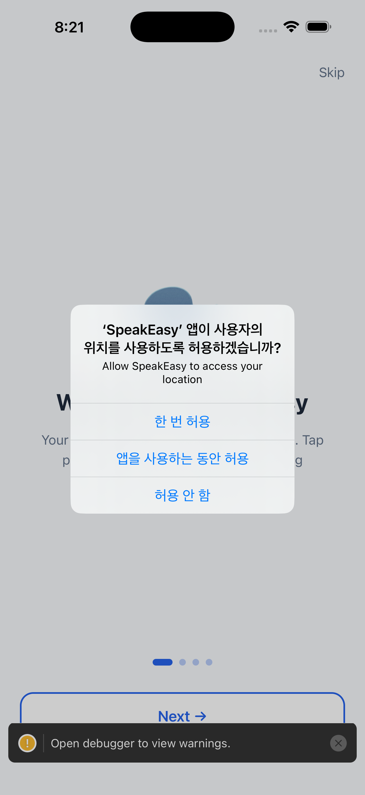
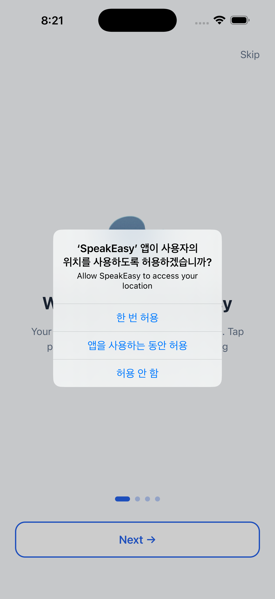
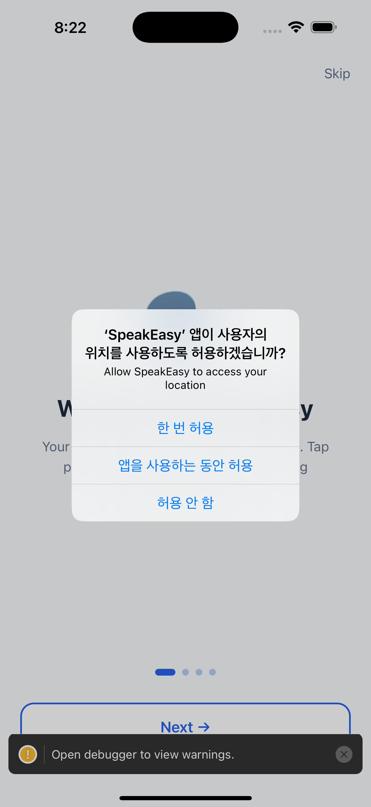
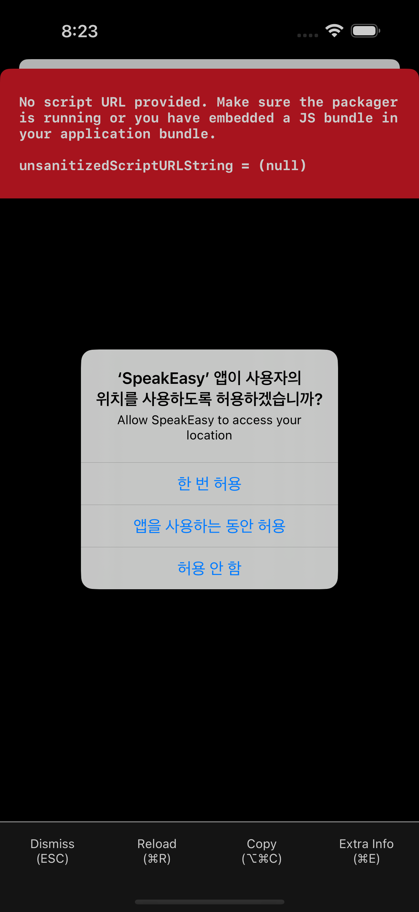
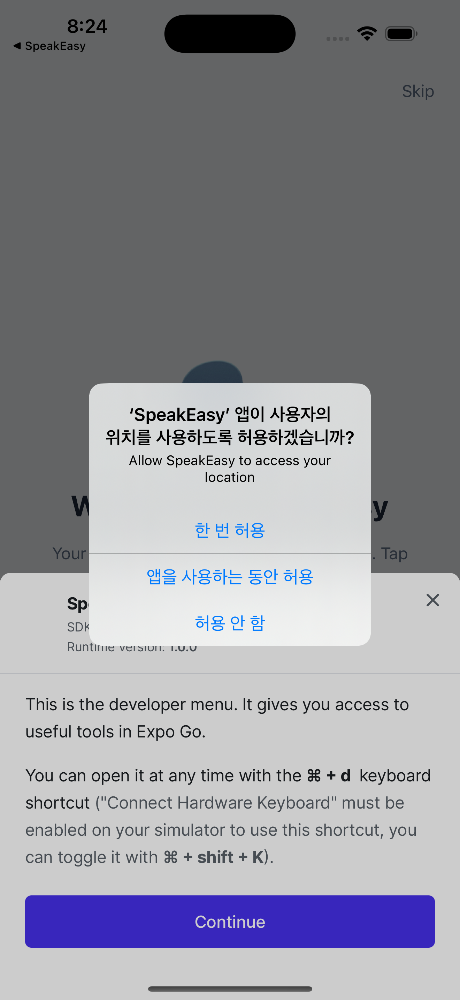

# AIdeas: SpeakEasy

> An offline-first AAC mobile app that gives voice to non-verbal users through context-aware phrase suggestions and on-device AI


---

## App Category

**Social Impact**

---

## My Vision

Communication is a fundamental human right, yet traditional AAC (Augmentative and Alternative Communication) tools often come with significant barriers: high costs, complex setup processes, cloud dependencies, and privacy concerns. I envisioned SpeakEasy as a mobile-first solution that removes these barriers.

SpeakEasy is an offline-first AAC app built with React Native and Expo that helps non-verbal users communicate naturally. The app suggests contextually relevant phrases based on location (home, school, hospital, restaurant, outdoor), time of day, weather conditions, and emotional state. Users can speak phrases aloud with native text-to-speech, create custom vocabulary, mark favorites, and trigger emergency caregiver alerts—all without requiring an internet connection or sending data to the cloud.

The app supports 20 interface languages with RTL-aware behavior for Arabic and Urdu, making it accessible to diverse communities worldwide.

---

## Why This Matters

Over 5 million people in the United States alone have difficulty producing speech, and globally, millions more rely on AAC tools to communicate. Yet existing solutions often fail to meet real-world needs:

- **Cost barriers**: Commercial AAC apps can cost hundreds or thousands of dollars
- **Privacy concerns**: Cloud-based systems require uploading sensitive communication data
- **Connectivity dependence**: Many tools fail without internet access
- **Complexity**: Setup and customization can be overwhelming for caregivers and users

SpeakEasy addresses these challenges by:

1. **Keeping everything on-device**: No user data leaves the phone, ensuring privacy and enabling offline use
2. **Context-aware intelligence**: The app adapts suggestions based on where you are, what time it is, and how you feel
3. **Immediate usability**: Simple touch interface with instant voice output
4. **Multilingual support**: 20 languages ensure accessibility across cultures
5. **Emergency support**: Built-in caregiver alert system for urgent situations

By making AAC technology more accessible, affordable, and privacy-respecting, SpeakEasy empowers non-verbal users to communicate with dignity and independence.

---

## How I Built This

### Technical Architecture

**Core Stack:**
- React Native 0.81 with Expo SDK 54
- TypeScript for type safety
- Zustand for state management
- Expo Router for navigation
- React Native Reanimated 4 for smooth animations

**Key Services:**
- `PredictionService`: Rule-based context-aware phrase generation
- `LLMService`: Dual-mode AI system (native on-device AI when available, rule-based fallback)
- `TTSService`: Native text-to-speech integration
- `NotificationService`: Local and caregiver alert system
- `ContextService`: Location, time, and weather context detection

### Development Milestones

**Phase 1: Core Communication (v1.0)**
- Implemented basic phrase suggestion engine with location and time-of-day context
- Integrated native TTS using expo-speech
- Built custom phrase creation and favorites system
- Designed v1-classic UI with accessibility-first approach

**Phase 2: Intelligence & Context (v1.1)**
- Added emotion-based phrase filtering
- Integrated weather-aware suggestions using expo-location
- Implemented phrase history tracking
- Built caregiver contact management and emergency alert flow

**Phase 3: AI & Polish (v1.1 - current)**
- Designed dual-mode AI system: native executorch support with rule-based fallback
- Rebuilt UI with v2-liquid-glass design system for modern glass-morphism aesthetic
- Added 20-language support with RTL layout handling
- Implemented onboarding flow with accessibility and language setup

### Technical Challenges Solved

1. **Offline-first architecture**: All phrase data, user preferences, and history stored locally using AsyncStorage
2. **Context detection without cloud**: Used device sensors and local weather APIs with graceful degradation
3. **AI runtime flexibility**: Built abstraction layer that switches between native AI (react-native-executorch) and rule-based predictions based on environment
4. **Accessibility compliance**: Followed WCAG 2.1 AA guidelines with proper roles, labels, and touch targets
5. **Cross-platform consistency**: Maintained identical UX on iOS and Android while respecting platform conventions

---

## Demo

### Main Communication Screen

*Context-aware phrase suggestions with location and emotion filters*

### Custom Phrases

*Create and manage personalized vocabulary*

### Favorites & History

*Quick access to frequently used phrases*

### Settings & Localization

*20 languages with voice customization*

### Emergency Support

*Caregiver alerts and emergency contact management*

### Onboarding

*Accessible setup flow for new users*

**Video Demo**: [Coming soon - 5-minute walkthrough]

---

## What I Learned

### Technical Insights

1. **Offline-first is harder than it looks**: Building a truly offline-capable app required rethinking every feature. I learned to design for graceful degradation—when GPS fails, fall back to saved locations; when weather APIs are unavailable, use time-of-day context instead.

2. **Context is king for AAC**: The difference between suggesting "Good morning" vs "I need help" can be life-changing. I learned that combining multiple context signals (location + time + emotion + history) creates far more relevant suggestions than any single factor.

3. **AI flexibility matters**: By building an abstraction layer that supports both native AI and rule-based fallback, I ensured the app works everywhere—from Expo Go during development to production builds with hardware acceleration.

4. **Accessibility is not optional**: Following WCAG guidelines from day one taught me that accessible design benefits everyone. Large touch targets, high contrast, and clear labels make the app easier for all users, not just those with disabilities.

5. **Privacy by design builds trust**: Keeping all data on-device wasn't just a technical choice—it became a core value proposition. Users and caregivers appreciate knowing their communication stays private.

### Development Journey Insights

1. **Start with the user, not the tech**: I initially focused on AI capabilities, but user testing showed that simple, predictable suggestions often work better than complex models. The rule-based fallback mode is sometimes preferred over AI.

2. **Versioned design systems enable iteration**: By building a theme versioning system (v1-classic, v2-liquid-glass), I could ship bold UI changes while maintaining rollback capability. This reduced fear of experimentation.

3. **Multilingual support is complex**: Supporting 20 languages taught me about RTL layouts, text expansion, and cultural context. Arabic and Urdu required completely different layout logic.

4. **Testing saves lives**: For an AAC app, bugs aren't just annoying—they can prevent communication in critical moments. I learned to write comprehensive tests for every user flow, especially emergency features.

### Personal Growth

Building SpeakEasy taught me that the best technology is invisible. The app's success isn't measured in AI sophistication or visual polish—it's measured in whether a non-verbal child can tell their parent "I love you" or a stroke survivor can order coffee independently.

This project reinforced my belief that developers have a responsibility to build inclusive technology. By focusing on accessibility, privacy, and offline capability, we can create tools that empower the most vulnerable members of our communities.

---

## Tags

`#aideas-2025` `#social-impact` `#APJC`

---

## Technical Details

- **Repository**: [GitHub - speak-easy](https://github.com/yourusername/speak-easy)
- **License**: MIT
- **Version**: 1.1.0
- **Platforms**: iOS, Android
- **Privacy Policy**: All data stored locally, no cloud backend required

---

## Try It Yourself

SpeakEasy is open source and available for testing. To run the development build:

```bash
cd mobile
npm install
npm start
```

For production builds with native AI support:

```bash
npm run ios
npm run android
```

---

*Built with ❤️ for the AAC community*
